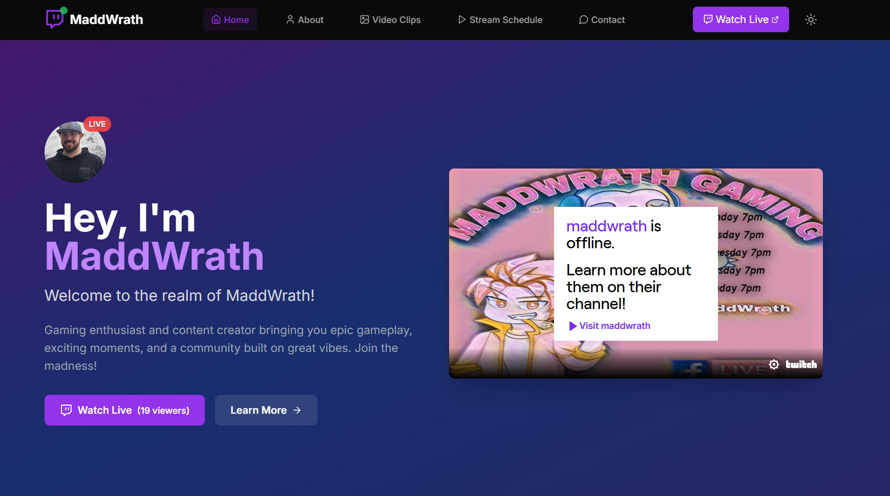

# Aaron's Twitch Streamer Portfolio

A modern, responsive website built with Next.js 15 for one of my clients:a Twitch streamers and content creators. This project showcases streaming content, community engagement, and provides a professional platform for building your streaming brand.



## 🚀 Features

- **Modern Design**: Clean, responsive UI with dark/light mode support
- **Multiple Pages**: 
  - Home with hero section, stats, about, video clips, stream schedule, and contact form
  - About page with streamer bio and achievements
  - Contact page with EmailJS integration for business inquiries
- **Responsive Layout**: Mobile-first design that works on all devices
- **SEO Optimized**: Built-in metadata and OpenGraph support
- **Type Safety**: Full TypeScript implementation
- **Modern Styling**: Tailwind CSS with custom design system
- **Smooth Animations**: Framer Motion for engaging interactions
- **Theme Support**: Dark/light mode with system preference detection

## 🛠️ Tech Stack

- **Framework**: Next.js 15 with App Router
- **Language**: TypeScript
- **Styling**: Tailwind CSS
- **Animations**: Framer Motion
- **Icons**: Lucide React
- **Theme**: next-themes for dark/light mode
- **Email Service**: EmailJS for contact form functionality
- **UI Components**: Radix UI primitives
- **Fonts**: Inter & JetBrains Mono (Google Fonts)


## 📦 Step-by-Step Replication Guide

Follow these steps to replicate and customize this portfolio project:

### 1. **Project Setup**

1. **Clone the repository:**
   ```bash
   git clone <repository-url>
   cd aaron-portfolio
   ```

2. **Install dependencies:**
   ```bash
   npm install
   ```

3. **Install EmailJS for contact form:**
   ```bash
   npm install @emailjs/browser
   ```

4. **Configure Tailwind CSS (if needed):**
   ```bash
   npx tailwindcss init -p
   ```
   Make sure your `tailwind.config.js` includes:
   ```js
   module.exports = {
     content: ["./src/**/*.{js,ts,jsx,tsx}"],
     theme: { extend: {} },
     plugins: [],
   };
   ```

5. **Set up global styles:**
   Edit `src/app/globals.css`:
   ```css
   @tailwind base;
   @tailwind components;
   @tailwind utilities;
   ```

6. **Configure EmailJS (Optional):**
   - Sign up at [EmailJS](https://www.emailjs.com/)
   - Create a service and email template
   - Update the service ID, template ID, and public key in `src/components/ContactForm.tsx`

7. **Run the development server:**
   ```bash
   npm run dev
   ```
   Open [http://localhost:3000](http://localhost:3000) in your browser.

---

### 2. **Customize Content**

1. **Streamer Info & Socials:**
   - Edit `src/lib/data.ts` to update your name, bio, social links, and stream schedule.

2. **Images & Branding:**
   - Replace images in the `public/` folder (e.g., avatar, gallery images) as needed.


3. **Pages:**
   - Home: `src/app/page.tsx` (hero, stats, about, video clips, schedule, contact)
   - About: `src/app/about/page.tsx`
   - Contact: `src/app/contact/page.tsx`

4. **Contact Form:**
   - Update EmailJS credentials in `src/components/ContactForm.tsx`
   - Replace service ID, template ID, and public key with your own

5. **Navigation:**
   - Update navigation links in `src/components/navbar.tsx` and `src/components/footer.tsx` as needed.

6. **Styling:**
   - Adjust colors, fonts, and layout in `tailwind.config.js` and `globals.css`.

---

### 3. **Enhance Functionality**

- **SEO Metadata:** Edit `src/app/layout.tsx` for OpenGraph, Twitter, and keywords.
- **Animations:** Use Framer Motion in your components for smooth transitions.
- **Email Integration:** Configure EmailJS for working contact forms.
- **Theme Support:** Use or remove `theme-provider.tsx` and `theme-toggle.tsx` as needed.

---

### 4. **Test and Deploy**

1. **Test locally:**
   ```bash
   npm run dev
   ```
2. **Deploy:**
   - Push your code to GitHub
   - Connect your repo to [Vercel](https://vercel.com) for instant deployment
   - Or deploy to Netlify, Railway, or other Next.js-friendly platforms

---

### 5. **Project Structure Overview**


```
src/
├── app/                 # Next.js App Router pages
│   ├── about/           # About page
│   ├── contact/         # Contact page
│   ├── layout.tsx       # Root layout
│   ├── page.tsx         # Home page
│   └── globals.css      # Global styles
├── components/          # Reusable React components
├── lib/                 # Utility functions and data
├── types/               # TypeScript type definitions
└── public/              # Static assets (images, etc.)
```

---

## 📝 Notes

- For more details, see comments in each file.
- You can remove the `.github/replication-guide.md` file—this README now contains all replication steps.

## 🔧 Development

### Available Scripts

```bash
# Development server
npm run dev

# Production build
npm run build

# Start production server
npm start

# Lint code
npm run lint
```


### Project Structure

```
src/
├── app/                 # Next.js App Router pages
│   ├── about/           # About page
│   ├── contact/         # Contact page
│   ├── layout.tsx       # Root layout
│   ├── page.tsx         # Home page
│   └── globals.css      # Global styles
├── components/          # Reusable React components
│   ├── navbar.tsx       # Navigation component
│   ├── footer.tsx       # Footer component
│   ├── ContactForm.tsx  # Email contact form with EmailJS
│   ├── theme-provider.tsx  # Theme provider
│   └── theme-toggle.tsx    # Theme toggle button
├── lib/                 # Utility functions and data
│   ├── data.ts          # Static data and content
│   └── utils.ts         # Utility functions
└── types/               # TypeScript type definitions
    └── index.ts         # Type definitions
```

## 🌐 Deployment

### Vercel (Recommended)
1. Push your code to GitHub
2. Connect your repository to [Vercel](https://vercel.com)
3. Deploy automatically with each push

### Other Platforms
The app can be deployed to any platform that supports Next.js:
- Netlify
- Railway
- AWS Amplify
- DigitalOcean App Platform


## 📱 Browser Support

- Chrome (latest)
- Firefox (latest)
- Safari (latest)
- Edge (latest)
- Mobile browsers (iOS Safari, Chrome Mobile)

## 🤝 Contributing

1. Fork the repository
2. Create a feature branch: `git checkout -b feature/new-feature`
3. Commit your changes: `git commit -am 'Add new feature'`
4. Push to the branch: `git push origin feature/new-feature`
5. Submit a pull request

## 📄 License

This project code was created solely by me, Kevin Llanos. The site owner is Aaron Melvorn

## 🙏 Acknowledgments

- Next.js team for the amazing framework
- Tailwind CSS for the utility-first CSS framework
- Framer Motion for smooth animations
- Lucide React for beautiful icons
- The streaming community for inspiration

---


